# AMASES - Adaptive Mutli Agent Skill Evolution System

## 1. Overview
LLMs can be highly capable in one skill while being comparatively weak in others, yet a fixed training curriculum treats their learning needs uniformly. AMASES addresses this by acting like a personalized gym for three LLM agents — Alpha, Beta, and Gamma. It is an OpenEnv-based reinforcement learning environment that continuously tracks their skills, identifies weaknesses, assigns targeted multi-agent tasks, evaluates performance through a structured reward system, and uses the resulting feedback to determine what they should practice next.

Instead of asking “What task should the agents solve next?”, AMASES asks “What skill do they need to improve next?”

## Core Idea

        ┌─────────────────┐
        │   Skill Graph   │
        │  What is weak?  │
        └────────┬────────┘
                 ↓
        ┌─────────────────┐
        │    Curriculum   │
        │ What task next? │
        └────────┬────────┘
                 ↓
        ┌─────────────────┐
        │   Environment   │
        │ Agents interact │
        └────────┬────────┘
                 ↓
        ┌─────────────────┐
        │     Reward      │
        │ How well did it │
        │     perform?    │
        └────────┬────────┘
                 ↓
        ┌─────────────────┐
        │   Skill Graph   │
        │    Updated      │
        └────────┬────────┘
                 │
                 └──────────→ Next Task

## 2. Key Features

- **Adaptive Skill-Based Curriculum** — Selects tasks based on the current skill gaps of Alpha, Beta, and Gamma.
- **Multi-Agent Skill Evolution** — Continuously tracks and evolves the capabilities of all three agents.
- **Dynamic Difficulty** — Adapts tasks across Easy, Medium, and Hard levels.
- **Diverse Interaction Scenarios** — Supports collaborative, competitive, mixed-motive, peer-teaching, and debate tasks.
- **Reward-Driven Learning** — Uses task performance and interaction quality to drive skill improvement.
- **Periodic Skill Verification** — Periodically tests whether learned skills generalize beyond regular training interactions.
- **OpenEnv-Based RL Environment** — Provides an environment designed for reinforcement-learning-based LLM training.


## 3. Architecture 
```text
-------------------           ----------------------------------         -------------        ------------------------------------
|Skill Graph       |  ------> |5 episodes of Each task category|------->| 6th Episode |------>|       Pick an Anchor Agent        |
|(Initial values)  |          |    (cold start)                |        |     Flow    |       |   Weakest skill level amoung all  |<----------
(level = 2.5)      |          ----------------------------------        ---------------       |      skills and all agents        |           |
(confidence = 0.1) |                                                                          ------------------------------------            |  
-------------------                                                                                        ↓                                  |
                                                                                         -----------------------------------------            |
                                                                                         |      Weak skill = anchor_agent.skill   |           |         
                                                                                         |   weak_level = anchor_agent.skill.level|           |
                                                                                         ------------------------------------------           |
                                                                                                          ↓                                   |     
                                                                                           --------------------------------                   | 
                                                                                          |    Chose Easy/ Medium/ Hard    |                  |
                                                                                          |    depening upon weak level    |                  |
                                                                                          |        <2.5 -> easy            |                  |
                                                                                          |        2.5 - 3.5 ->Medium      |                  |
                                                                                          |        >3.5 ->Hard             |                  |
                                                                                           --------------------------------                   |
                                                                                                          ↓                                   |
                                                                                ┌──────────────────────────────────────────────────────────┐  |
                                                                                │  Select a task that tests the weak skill and belongs     │  |
                                                                                │  to the selected difficulty bucket.                      │  |
                                                                                │                     (Task Library)                       │  |
                                                                                └──────────────────────────────────────────────────────────┘  |
                                                                                                          ↓                                   |
                                                                                            ┌──────────────────────────┐                      |
                                                                                            │   Agents perform task    │                      |
                                                                                            └──────────────────────────┘                      |
                                                                                                          ↓                                   |
                                                                                            ┌──────────────────────────┐                      |
                                                                                            │    Reward Calculated     │                      |
                                                                                            └────────────┬─────────────┘                      |
                                                                                                         ↓                                    |              
                                                                                            ┌──────────────────────────┐                      |    
                                                                                            │ Task solved OR max turns │                      |    
                                                                                            │ reached → Episode ends   │                      |    
                                                                                            └────────────┬─────────────┘                      |
                                                                                                         ↓                                    |
                                                                                            ┌──────────────────────────┐                      |
                                                                                            │ Target = 5 × Reward      │                      |
                                                                                            │ EMA: New = 0.9×Old       │                      |
                                                                                            │      + 0.1×Target        │                      |
                                                                                            └────────────┬─────────────┘                      |
                                                                                                         ↓                                    |             
                                                                                            ┌──────────────────────────┐                      |   
                                                                                            │    Skill Graph Updated   │----------------------
                                                                                            └────────────-─────────────┘
                                                                                                        

```


## 4. Project structure

```text
skillgraph-adaptive-llm/
│
├── README.md                               # Project documentation
│
└── skillgraph_adaptive_env/
    │
    ├── models.py                          # Action and observation schemas
    ├── client.py                          # Client for interacting with the environment
    ├── openenv.yaml                       # OpenEnv configuration
    ├── pyproject.toml                    # Dependencies and package configuration
    │
    ├── server/
    │   ├── app.py                         # Server entry point
    │   ├── skillgraph_adaptive_env_environment.py
    │   │                                    # Core adaptive environment logic
    │   ├── agent_manager.py               # Agent registry and team formation
    │   ├── curriculum_engine.py           # Adaptive task selection engine
    │   ├── task_library.py                # Multi-agent task definitions
    │   ├── skill_graph.py                 # Skill tracking and progression graph
    │   ├── interaction_memory.py          # Public and private interaction memory
    │   ├── scoring.py                     # Reward computation and evaluation logic
    │   └── model_runtime.py               # Hugging Face model runtime wrapper
    │
    └── training/
        ├── run_training_trl_grpo.py        # GRPO reinforcement learning training pipeline
        └── colab_day1_sprint.ipynb         # Colab notebook for experimentation and training
```

## 6. Traning Workflow

## Training workflow (current)

Install:

```bash
pip install -e skillgraph_adaptive_env
pip install -r skillgraph_adaptive_env/training/requirements-colab.txt
```

Run GRPO with real rollout responses:

```bash
python -m skillgraph_adaptive_env.training.run_training_trl_grpo \
  --episodes 10 \
  --seed 7 \
  --max-turns 6 \
  --model-id Qwen/Qwen2.5-0.5B-Instruct \
  --rollout-model-id meta-llama/Llama-3.2-1B-Instruct \
  --hf-token <YOUR_HF_TOKEN> \
  --rollout-max-tokens 64 \
  --max-samples 70 \
  --epochs 1 \
  --max-completion-length 28 \
  --batch-size 2 \
  --grad-accum-steps 2 \
  --num-generations 2 \
  --grpo-temperature 0.9 \
  --out-dir training/runs/trl_grpo_tuned_10ep
```

```mermaid
flowchart TD
    A["Skill Graph Initialized<br/>level = 2.5 (±offset per agent: alpha 2.50, beta 2.45, gamma 2.55)<br/>confidence = 0.1"] --> B

    B["Cold Start: Episodes 1-5<br/>Fixed medium-difficulty task, one per type:<br/>collaborative → competitive → mixed_motive →<br/>peer_teaching → debate<br/>(same for every agent, no adaptation)"] --> C

    C{"Episode 6 onward"} --> E["Select Anchor Agent<br/>= agent with globally weakest skill<br/>(lowest level × max(confidence, 0.15)<br/>across all agents, all skills)"]

    E --> F{"episode_idx % 20 == 0 ?"}
    F -->|Yes| G["Verification check:<br/>fixed diagnostic task<br/>(cycles peer_teaching → competitive →<br/>collaborative → debate → mixed_motive)<br/>no randomized surface, medium difficulty<br/>is_verification = True"]
    F -->|No| H["Adaptive path"]

    H --> H1["Read anchor agent's skill scores<br/>(from skill_graph snapshot)"]
    H1 --> H2["Find anchor's single weakest skill:<br/>key = level × max(confidence, 0.15)<br/>lowest key wins"]
    H2 --> H3{"Bucket weak_level"}
    H3 -->|"< 2.5"| H4a["Easy"]
    H3 -->|"2.5 – 3.5"| H4b["Medium"]
    H3 -->|"> 3.5"| H4c["Hard"]
    H4a --> H5
    H4b --> H5
    H4c --> H5["Select task from library:<br/>must test weak_skill AND<br/>match bucket's difficulty range<br/>(fallback: difficulty-only, then any task)"]
    H5 --> H6["Instantiate task:<br/>fill randomized surface slots<br/>tag target_skill = weak_skill"]

    G --> D
    H6 --> D["Form team<br/>(AgentManager.form_team)<br/>shuffles agents, takes agent_count for this task"]
    D --> I["Reset InteractionMemory<br/>post task prompt publicly,<br/>assign each agent private preference"]

    I --> J["Agents perform task<br/>(turn-limited: 8 / 12 / 15 turns<br/>depending on difficulty tier)"]
    J --> K["Episode ends:<br/>task solved OR max_turns reached"]
    K --> L["Reward function scores transcript<br/>per tested skill (2-3 skills per task)"]
    L --> M["For each tested skill, each participating agent:<br/>target_level = reward_score × 5.0<br/>new_level = 0.9 × old_level + 0.1 × target_level<br/>(EMA update)"]
    M --> N["Update streak, confidence (n/20 capped at 1.0),<br/>learning_velocity, plateau<br/>per skill"]
    N --> O["Skill Graph updated"]
    O --> C
```

| Task Category | Difficulty Tier | Task Name (ID) | Skills Tested | Difficulty Score |
|---|---|---|---|---:|
| Collaborative | Easy | `collaborative_easy` | collaboration, problem_decomposition, communication | 2.0 |
| Collaborative | Medium | `collaborative_medium` | information_synthesis, collaboration, communication | 3.0 |
| Collaborative | Hard | `collaborative_hard` | information_synthesis, strategic_reasoning | 4.4 |
| Competitive | Easy | `competitive_easy` | negotiation, competitive_strategy, opponent_modeling | 2.2 |
| Competitive | Medium | `competitive_medium` | competitive_strategy, risk_assessment, opponent_modeling | 3.1 |
| Competitive | Hard | `competitive_hard` | competitive_strategy, strategic_reasoning, negotiation | 4.5 |
| Mixed Motive | Easy | `mixed_motive_easy` | collaboration, strategic_reasoning, negotiation | 2.4 |
| Mixed Motive | Medium | `mixed_motive_medium` | strategic_reasoning, risk_assessment, collaboration | 3.3 |
| Mixed Motive | Hard | `mixed_motive_hard` | strategic_reasoning, collaboration, long_term_planning | 4.6 |
| Peer Teaching | Easy | `peer_teaching_easy` | communication, meta_learning, knowledge_transfer | 2.1 |
| Peer Teaching | Medium | `peer_teaching_medium` | communication, meta_learning | 3.0 |
| Peer Teaching | Hard | `peer_teaching_hard` | meta_learning, communication | 4.2 |
| Debate | Easy | `debate_easy` | information_synthesis, communication, argumentation | 2.6 |
| Debate | Medium | `debate_medium` | argumentation, information_synthesis | 3.4 |
| Debate | Hard | `debate_hard` | argumentation, strategic_reasoning | 4.8 |
Train again on same dataset (no new rollouts):

```bash
python -m skillgraph_adaptive_env.training.run_training_trl_grpo \
  --train-only \
  --model-id Qwen/Qwen2.5-0.5B-Instruct \
  --max-samples 70 \
  --epochs 5 \
  --max-completion-length 28 \
  --batch-size 2 \
  --grad-accum-steps 2 \
  --num-generations 2 \
  --grpo-temperature 0.9 \
  --out-dir training/runs/trl_grpo_tuned_10ep
```

## Output artifacts

Typical run output directory:

- `grpo_dataset.json`
- `episode_logs.csv`
- `summary.json`
- `eval_summary.json`
- `checkpoints/final/`
- `plots/reward_vs_steps.png`
- `plots/success_rate_trend.png`
- `plots/reward_components.png`
- `plots/skill_evolution.png`
- `plots/training_loss.png`

## Notes

- Early episodes are fixed diagnostics (`collaborative`, `competitive`, `mixed_motive`, `peer_teaching`, `debate`), then curriculum switches to weak-skill targeting.
- Success can remain sparse under strict tasks; monitor reward components and skill evolution jointly.
- For the latest reproducible run recipe, prefer the notebook at `skillgraph_adaptive_env/training/colab_day1_sprint.ipynb`.


## Reward logic

```text
Final Reward =
0.24 × Task Success
+ 0.31 × Skill Demonstration
+ 0.21 × Collaboration Quality
+ 0.16 × Learning Evidence
+ 0.08 × Meta-Cognition
− Penalties
```

| Component                 | Meaning                                                                                                           | Weight   | Code Implementation                                                                                                                    |
| ------------------------- | ----------------------------------------------------------------------------------------------------------------- | -------- | -------------------------------------------------------------------------------------------------------------------------------------- |
| **Task Success**          | Checks whether the agents solved the task and how efficiently they did it.                                        | **0.24** | `_task_success_score()` uses `agreement_reached`, `quality`, and `turns_used / max_turns`.                                             |
| **Skill Demonstration**   | Measures whether the response shows the expected target skill (negotiation, planning, synthesis, teaching, etc.). | **0.31** | `_skill_demo_score()` searches for task-specific reasoning patterns such as `counter`, `trade-off`, `evidence`, `plan`, and `example`. |
| **Collaboration Quality** | Evaluates whether the agent contributes meaningfully instead of repeating generic responses.                      | **0.21** | `_collab_quality()` combines **context usage**, **turn balance**, and **repetition detection**.                                        |
| **Learning Evidence**     | Rewards adaptation, revision, and improvement across turns.                                                       | **0.16** | `_learning_evidence()` checks for signals such as `revise`, `update`, `improve`, and other novel follow-up behavior.                   |
| **Meta-Cognition**        | Rewards realistic self-assessment rather than overconfidence.                                                     | **0.08** | `_meta_cognition()` compares `self_rating` with the internally computed quality score and rewards smaller differences.                 |

---


---

## 🚫 Penalty System (Anti-Reward Hacking)

The environment subtracts penalties from the rubric reward to prevent agents from exploiting the evaluation rules.
| Penalty | Trigger | Purpose | Deduction |
|----------|---------|---------|-----------|
| **instant_agreement_hack** | Agents agree within the first 1–2 turns without real reasoning. | Prevents trivial task completion. | **0.18** |
| **proposal_repetition** | The same proposal is repeated across recent turns. | Discourages looping behavior. | **0.08** |
| **context_ignoring** | Expected task keywords or context are missing. | Forces responses to stay grounded in the task. | **0.05** |
| **timeout_failure** | Collaborative tasks reach the maximum turn limit without convergence. | Penalizes inefficient coordination. | **0.12** |
| **incoherent_output** | Extremely short or nonsensical responses. | Maintains minimum response quality. | **0.18** |
| **self_assessment_inflation** | Self-rating is much higher than the computed quality score. | Prevents confidence gaming. | **0.08** |
| **keyword_stuffing** | Excessive repetition of rubric keywords. | Stops agents from earning reward through token spam. | **0.10–0.20** |
| **low_task_alignment** | Response has very low overlap with the actual prompt details. | Prevents generic LLM answers unrelated to the task. | **0.06** |
## Deployed environment

- Hugging Face Space: [https://huggingface.co/spaces/jeeya-ahuja05/skill-graph-adaptive-env](https://huggingface.co/spaces/jeeya-ahuja05/skill-graph-adaptive-env)
