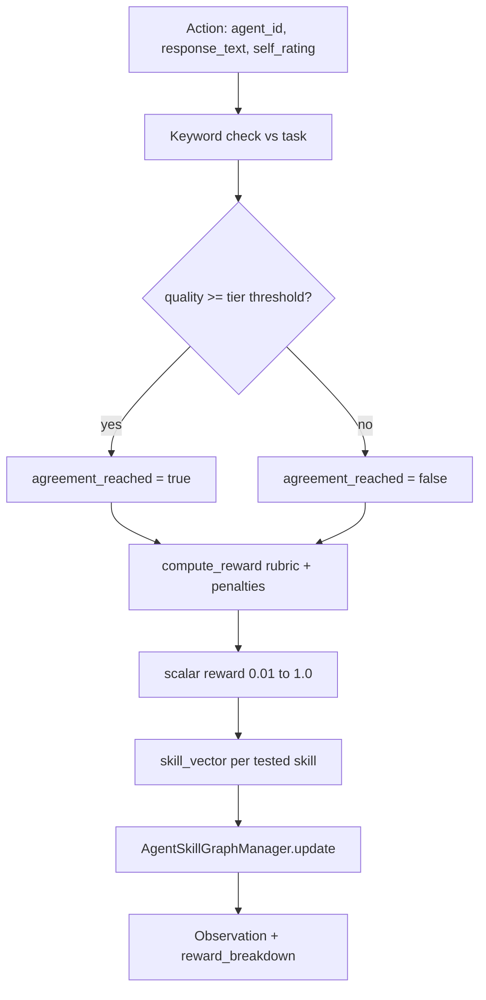

# AMASES reward logic (full pipeline)

## End-to-end flow (one `step`)

## Layer 1 — Task success gate (`_evaluate_turn`)

- Each task has `check_keywords` (e.g. `evidence`, `synthesis`, `trade-off`, `summary`).
- `quality = (# keywords found) / (# keywords)`.
- `solved` if `quality >= threshold` (easy 0.45, medium 0.55, hard 0.62).
- This feeds `outcome.agreement_reached` and `outcome.quality` into the rubric.
- **Hardening**: `quality` is **capped** inside `task_success` so keyword spam can’t dominate reward.

## Layer 2 — Rubric (`compute_reward` in `server/scoring.py`)

Weighted sum (weights sum to 1.0):

| Component | Weight | Meaning |
|-----------|--------|---------|
| `task_success` | 0.24 | Agreement + efficiency + quality |
| `skill_demo` | 0.31 | Role/task-specific lexical signals |
| `collab_quality` | 0.21 | Uses prior turns + task keywords in text |
| `learning_evidence` | 0.16 | Novelty after turn 5 |
| `meta_cognition` | 0.08 | Self-rating aligned with rubric |

**Scalar** = weighted sum − sum(penalties), floor **0.01**.

### Penalties (anti-hacking)

- `instant_agreement_hack` — solved too fast without negotiation language
- `proposal_repetition` — same text repeated
- `context_ignoring` — missing task `check_keywords`
- `keyword_stuffing` — too many keyword hits per token / very short keyword-soup answers
- `low_task_alignment` — response doesn’t mention prompt surface details (city/topic/budget/etc.)
- `timeout_failure` — episode ended unsolved (collab / mixed_motive)
- `incoherent_output` — very short text
- `self_assessment_inflation` — self_rating much higher than rubric

## Layer 3 — Skill graph update (`AgentSkillGraphManager`)

- Each tested skill gets a target from `skill_vector` (keyword hits + rubric blend).
- Level updates: `level ← (1−α)·level + α·(reward_score×5)` with α=0.1.
- Streak, confidence, learning_velocity, plateau flags tracked for curriculum.

## Layer 4 — Curriculum (`CurriculumEngine`)

- Picks tasks targeting **weakest** skills (confidence-weighted).
- Episodes 1–5: diagnostics; periodic verification tasks.
- Difficulty bucket (easy/medium/hard) from current skill level.

## What moves the graphs (for experiments)

1. **Better responses** → higher `task_success` + `collab_quality` (keywords matter).
2. **Honest self_rating** → higher `meta_cognition` (match rubric, ~0.7–0.8).
3. **Multi-turn episodes** → `learning_evidence` rises after turn 5.
4. **Episode ramp policy** (training script) → simulates improving policy over time.
5. **Episode solve bonus** (+0.08) → clear spike when task completes.

## Training scripts

| Script | Reward source |
|--------|----------------|
| `run_training_trl_grpo.py` | `obs.reward` from env after each step |
| `run_training_three_models.py` | Same + real HF model text |

Plots: `reward_vs_steps`, `success_rate_trend`, `reward_components`, `skill_evolution`.

## Space playground tips

Use task keywords **naturally** (don’t spam). Mention the prompt details (city/topic/budget) and keep self_rating near observed reward (~0.5–0.8).

## LLM-as-judge (future improvement, not required day‑1)

`llm_judge_score()` exists but is **not** called in the live Space loop by default. It’s best treated as a later upgrade:
- run only on the **final** turn of an episode or a small sample of turns
- blend with rubric (`merge_scores`) to reduce reward hacking at the cost of API spend
